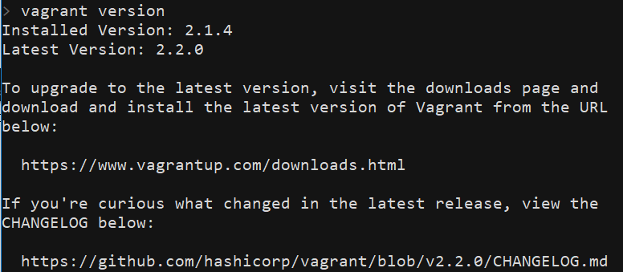
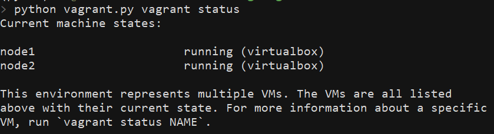
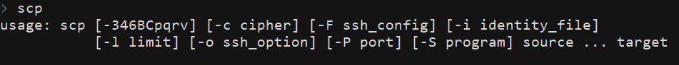
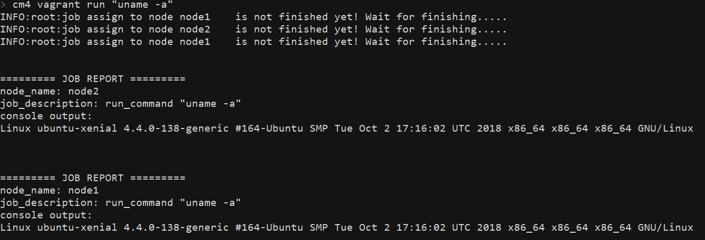

# Ehvagrant with Cloudmesh: enhanced Vagrant interface integrated with Cloudmesh

[TOC]

----

## Introduction

### What is Vagrant and Ehvagrant ?

[Vagrant](https://www.vagrantup.com/) is a open-source software that help you to build and manage virtual machines through command line interface. Ehvagrant provide you an *enhanced* command line Vagrant interface that enable users to utilize Vagrant functionalities *in an earlier way*.

The major enhancement of Ehvagrant interface is that it enables you to execute
the same job on multiple Vagrant instances at the same time, including:

- transfer file and folder between host machine and instances

- execute command or script on instances.

This allows you to test a program on multiple virtual machines, which
may have different OS and working environment, at the same time, by
just issuing a **single** command.

### What is Cloudmesh? What does it means by "Ehvagrant integrated with Cloudmesh"?

Cloudmesh is an integrated cloud platform manage tool. When integrates Ehvagrant with Cloudmesh, it means you can manage Vagrant instances through Cloudmesh interfaces, which the functionalities itself are provided by Ehvagrant. In fact, Ehvagrant is originally developed as a module of Cloudmesh. 

The following manual guides you How to setup Ehvagrant with Cloudmesh and how to use it.

-----

## Setup Walkthrough

### Requirement summary

Minimum  requirements to use Ehvagrant with Coudmesh are the following:

- Python 3 and `pip`should be available on the host machine. 
- A working Vagrant software work with appropriate [virtualization provider](#Install-*virtualization-provider*). 
- `scp` functionality should be available on the host machine. 
- Currently, Ehvagrant just support the virtual machine that are running an Unix-like OS, such as Ubuntu.

### Install Ehvagrant 

When you use Ehvagrant which integrated with Cloudmesh, Ehvagrant become a module of Cloudmesh, so the only thing you have to do regarding installing Ehvagrant is to install Cloudmesh, then you are done.

### Install Vagrant

You can download Vagrant from [here](https://www.vagrantup.com/downloads.html). It supports all mainstream operating system, including Windows, Mac OS, and various Linux distribution. After finishing installation, you can check if the installation successes by executing `vagrant version`. You should see something like below.



### Install *virtualization provider*

Although Vagrant help you with managing virtual machines, Vagrant
itself does not *handle the task of virtualization*. Vagrant rely on
virtualization software or even cloud service provider to do the
actual work of *virtualization* -- running virtual machine on top of
host machine, provisioning computational and storage resources to
virtual machines, communicating between host and virtual
machine...etc. 

In other word, to leverage Vagrant functionality, **you need to install Vagrant along with virtualization provider and/or the correspondent Vagrant plugin** that enables Vagrant to interact with virtualization provider.

The default virtualization provider of Vagrant is [VirtualBox](https://www.virtualbox.org/). You don't have to install any plugin to let Vagrant working with VirtualBox. However, you indeed need to install VirtualBox if it doesn't exist on your host machine. In this case please refer to [VirtualBox downloand page](https://www.virtualbox.org/wiki/Downloads). Also, please note that using VirtualBox as the virtualization provider implies virtual machines will run on your host machine. So make sure there are sufficient resources on your host machine. 

You may choose other virtualization provider. In this case, please setup virtualization provider of your choice and follow the [Vagrant user manual]('https://www.vagrantup.com/docs/providers/') to setup Vagrant with correspondent plugin. If there is no special need that you have to address, we strongly recommend you just go with VirtualBox.

### Configure `Vagrantfile`

`Vagrantfile` is the main configuration file of Vagrant. Vagrant will
only interact with the virtual machines defined in the `Vagrantfile`.

To utilized Ehvagrant with Cloudmesh, `Vagrantfile` should be stored
at`VAGRANTFILE_PATH`. The default `VAGRNATFILE_PATH` when you use Ehvagrant with Cloudmesh will be `~/.cloudmesh/vagrant_workspace/Vagrantfile`.  You should set this value to the `~/.cloudmesh/cloudmesh4.yaml`. 

Ehvagrant will try to locate `Vagrantfile` every time it invokes. If
it can't find it, Ehvagrant will generate a default `Vagrantfile` at
default path. The Default `Vagrantfile` defines two Ubuntu machine called
`node1` and `node2`, powered by VirtualBox.

You can use [create](#create-instances) functionality to easily setup a `Vagrantfile` which defines any amount of virtual machine as you want. Moreover,  you can also try to customize your ow`Vagrantfile`. Please refer to [Vagrant user manual](https://www.vagrantup.com/docs/vagrantfile/) tosee how to do that. Don't forget that currently Ehvagrant just supports Unix-like OS, and after finishing your modification on`Vagrantfile`, save it at `VAGRANTFILE_PATH`.

 The following walkthrough assumes you go with the auto-generated default
`Vagrantfile`.

### Initialize virtual machine

After finishing `Vagrantfile`definition, you are now ready to deploy
and run your virtual machine with Vagrant. But first, let us check
current status of your Vagrant provider. Execute `cm4 vagrant list` at
console, you will see:


Then execute `cm4 vagrant start`. Since your machines are not deployed
yet, Vagrant will first deploy your machines and then bring them up,
and automatically do LOTS of setting. When Vagrant has done its work,
we can confirm this by issuing `cm4 vagrant list` again. You will see now:



HOO-WA! Your two virtual machines are painlessly deployed, configured,
up and running! Now you are ready to do some fancy work with Vagrant
and Ehvagrant.

### Micellouenes: setup `scp` on host machine

Since these topics are not directly relate to Ehvagrant, here I just
describe how do you check these functionally are working properly.

For `scp`, open terminal and execute `scp`, you should see a short
usage guide shows on your screen. If it is not there, please install
`scp` and make sure its executive file is in your `PATH` environment
variable.




------

## Using Ehvgrant intergrated with Cloudmesh

### Introduction

#### Which instances will be affected by my command?

Commands will only affect the instances that belongs to *current
Vagrant environment*, which is defined by the `Vagrantfile` locates at
`VAGRNANTFILE_PATH`. Instances are identified by its name.

#### How to specify instances I want to work with?

Use`--vms=<vmList>` option to specify which instances you want to work with. Your `<vmList>` string will be parsed by [python-hostlist](https://www.nsc.liu.se/~kent/python-hostlist/) package. Here are some example how your `<vmList>` string will be parsed:

```
>>> hostlist.expand_hostlist('a,b,c')  # --vms=a,b,c
['a', 'b', 'c']

>>> hostlist.expand_hostlist('node[1-5]') # --vms=node[1-5]
['node1', 'node2', 'node3', 'node4', 'node5']
```

Most of commands can work **without** `--vms`. But Be careful, issuing a
command without specifying instances will usually affect **all** of
the instances that are available in the current vagrant environment.

#### Before Start

Before transferring file or folder between host and instances or
running commands or scripts on instances, you must make sure that
all of the instances you want to work with are **up, running, and
reachable through network.**

### Manage instances

#### create instances

Usage: `cm4 vagrant create --count=VMNUMBER`

Generate a `Vagrantfile` that defines multiple instances, use `--count` option to specify how many instances you want to create. **This
functionality can only define instances working with VirtualBox**.

#### start up instances

Usage: `cm4 vagrant start [--vms=<vmList>]`

Start up stopped or suspended instances. If instances have not been deployed yet,   it will first deploy and configure instances, and at last start them.

#### resume instances

Usage: `cm4 vagrant resume [--vms=<vmList>]`

resume suspended instances.

#### stop instances

Usage: `cm4 vagrant stop [--vms=<vmList>]`

Shut down instances. Any unsaved data will be lost. 

#### suspend instance

Usage: `cm4 vagrant suspend [--vms=<vmList>]`

Save current state of instances and then stop it. Unsaved data will
not lost and user can restore the current state and continue to work
latter on.

#### destroy instances

Usage:```cm4 vagrant destroy [--vms=<vmList>]```

Destroy Vagrant instances. The data stored on the instance will be lost.

#### show current status of instances

Usage: `cm4 vagrantvagrant list`

Show the status of all Vagrant instances belonging to the current environment. 

#### show current status of specific instance

Usage: `cm4 vagrant status Name` 

Show the status of instance specified by `Name`.

###  Transfer file and folder between host and instances

- The following functionality are implemented by utilizing `scp `
   command. [As previously mentioned](#Micellouenes:-setup-python-3-and-`scp`-on-host-machine), please make sure `scp` functionality is available on your host machine.
- If you specify a folder as the target to be uploaded/downloaded, all
   of its contents will be uploaded/downloaded.
- **To specify a folder, just put a `/` in the end of the path
   string**. For example, `A/smaple/folder/string/`; Or use `-r` flag to
   indicates the target is a folder.

#### upload file or folder (from host to instances)

Usage:`cm4 vagrant upload --from FROM --to TO [-r] [--vms=<vmlist>]`

Upload file or folder on host machine to instances.

#### download file or folder (from instances to host)

Usage:`cm4 vagrant download --from FROM --to TO [-r] [--vms=<vmlist>]`

If you try to download file or folder from two or more
instances simultaneously, data will be parallelly downloaded and be
separately stored in a folder which name after the instances' `name` .

For example, if user try to download `~/foo.txt` simultaneously from
`node1` and `node2`, and designate `./bar/foo.txt` as the host file
path, then Ehvagrant will automatically modify the host file path,
copy `~/foo.txt` on `node1` into `./bar/node1/foo.txt` and copy
`~foo.txt`on `node2` into `./bar/node2/foo.txt`.

### Execute arbitrary shell command or script on instances

#### start a ssh session

Usage: `cm4 vagrant ssh NAME`

Launch a secure-shell session which connects to the vagrant instance specified by ```NAME```.


#### run arbitrary shell command

Usage: `cm4 vagrant run COMMAND [--vms=<vmList>]`

Run an arbitrary shell `COMMAND` on instances. If user specify
multiple instances to run, the command will run on those instances
simultaneously, i.e., in a parallel fashion. Any output produced to
the `stdout` and `stderr` of executing instances will be fetched and
reformatted to a job report. Finally, the job report will print out to
the current terminal.



#### run arbitrary shell script

Usage: ```cm4 vagrantvagrant run script SCRIPT [--data=PATH] [--vms=<vmList>]```

Run an arbitrary **shell script** on instances. The behavior of this
command will comply with `run command`, plus extra features defined as
following:

* positional argument `SCRIPT` is the path of the script file to be
  executed, which must locates on the host machine. It will be uploaded
  and stored at the `JOB_FOLDER` of all executing instances, which
  locates at` ~/cm_experiment/{script_name}_{epoch_second}/`.

* If there is any data that must be run against the script, specify
  the path of the data with `--data` argument. **If you specify a folder
  in `--data`, you must put `/` in the end of folder path or use `-r` option to specify it is a folder**. The data 
  will be copied into `$JOB_FOLDER/data/` directory of all executing
  instances.

* About the script and its execution:

  * If the script will ever produce any output file, it should be
    stored at `$JOB_FOLDER/output/` directory. The behavior including building the `$JOB_FOLDER/output/` folder and storing result file to that folder **should be handle by the script itself**.

  * When execution, the script will always receive `JOB_FOLDER` as its first argument. This value can be used in various ways. For example, to build the `$JOB_FOLDER/output/` folder.

* After execution, if there is any file output exist in ` $JOB_FOLDER$/output/` of all executing instances, then it will all be fetched and stored to `~/.cloudmesh/experiment/{instnace_name}/{script_name}_{epoch_second}/output/` on the host machine.. 

* Finally, execution reports will be printed out to current terminal.


